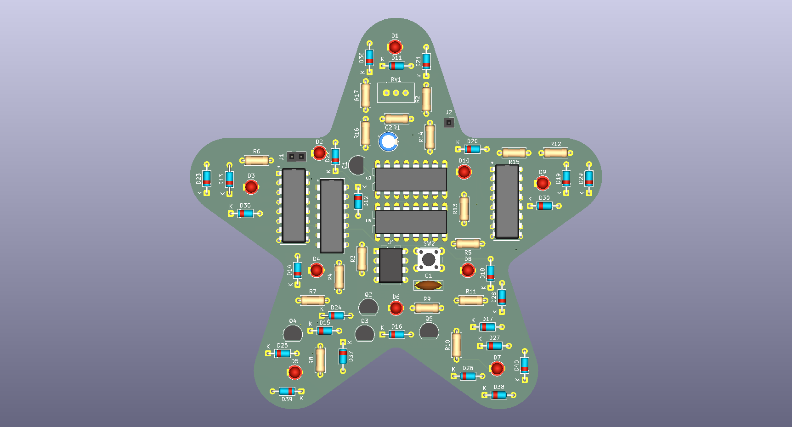
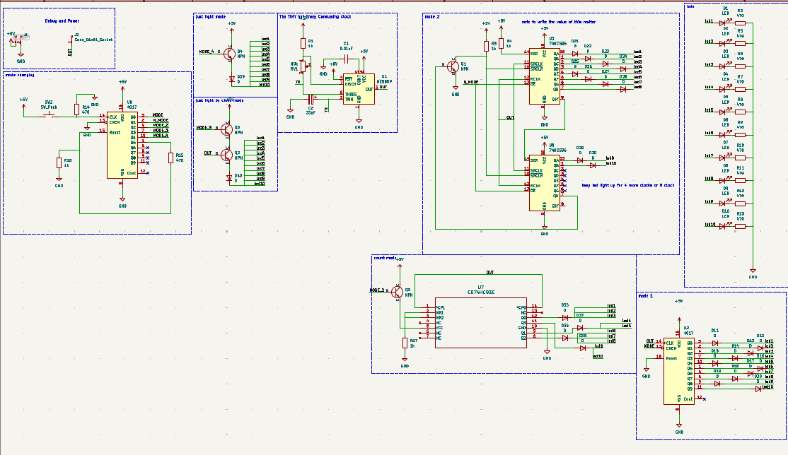

# 555 Chaser LED

This is the one led board with 5 effects. These effects are:

- Blinky effect (each led will light-up then off for next led)
- Bit Counting (That is the calculator with led)
- Bar led ( These Stack up each clock )
- Breath effect ( fade up and fade down )
- On Mode ( their light up all led their have )

This is the result board

Also for someone want to know how that work

Also with the BOM (bill of material) of project is

| Reference                                                                                               | Qty | Value             | Footprint                                                     | Datasheet                                                                       | LCSC Part # | DIGIKEY_LINK                                                             | Price |
|---------------------------------------------------------------------------------------------------------|-----|-------------------|---------------------------------------------------------------|---------------------------------------------------------------------------------|-------------|--------------------------------------------------------------------------|-------|
| C1                                                                                                      | 1   | 0.01uF            | Capacitor_THT:C_Disc_D7.5mm_W2.5mm_P5.00mm                    |                                                                                 | C52205045   |                                                                          | 0.56  |
| C2                                                                                                      | 1   | 33uF              | Capacitor_THT:CP_Radial_D5.0mm_P2.00mm                        |                                                                                 | C20539524   |                                                                          | 0.74  |
| D1,D2,D3,D4,D5,D6,D7,D8,D9,D10                                                                          | 10  | LED               | LED_THT:LED_D3.0mm                                            |                                                                                 | C99772      |                                                                          | 0.73  |
| D11,D12,D13,D14,D15,D16,D17,D18,D19,D20,D21,D22,D23,D24,D25,D26,D27,D28,D29,D30,D35,D36,D37,D38,D39,D40 | 26  | D                 | Diode_THT:D_DO-35_SOD27_P7.62mm_Horizontal                    |                                                                                 | C402212     |                                                                          | 0.47  |
| J1                                                                                                      | 1   |                   | Connector_PinSocket_2.54mm:PinSocket_1x02_P2.54mm_Vertical    |                                                                                 | C7499322    |                                                                          | 0.46  |
| J2                                                                                                      | 1   | Conn_01x01_Socket | Connector_PinSocket_2.54mm:PinSocket_1x01_P2.54mm_Vertical    |                                                                                 | C6302252    |                                                                          | 1.15  |
| Q1,Q2,Q3,Q4,Q5                                                                                          | 5   | NPN               | Package_TO_SOT_THT:TO-92_Inline                               | https://ngspice.sourceforge.io/docs/ngspice-html-manual/manual.xhtml#cha_BJTs   | C22751480   |                                                                          | 0.75  |
| R1,R3,R4,R16,R17                                                                                        | 5   | 1k                | Resistor_THT:R_Axial_DIN0207_L6.3mm_D2.5mm_P7.62mm_Horizontal |                                                                                 | C3359542    |                                                                          | 1.14  |
| R2,R5,R6,R7,R8,R9,R10,R11,R12,R13,R14,R15                                                               | 12  | 470               | Resistor_THT:R_Axial_DIN0207_L6.3mm_D2.5mm_P7.62mm_Horizontal |                                                                                 | C1754684    |                                                                          | 2.74  |
| RV1                                                                                                     | 1   | 50k               | Potentiometer_THT:Potentiometer_Vishay_T93YA_Vertical         |                                                                                 | C7061697    |                                                                          | 3.2   |
| SW2                                                                                                     | 1   | SW_Push           | Button_Switch_THT:SW_PUSH_6mm_H9.5mm                          |                                                                                 | C2689645    | https://www.digikey.com/en/products/detail/c-k/PVA1-OA-H1-1-2N-V2/417717 | 3.04  |
| U1                                                                                                      | 1   | NE555P            | Package_DIP:DIP-8_W7.62mm                                     | http://www.ti.com/lit/ds/symlink/ne555.pdf                                      | C46749      |                                                                          | 1.36  |
| U2,U6                                                                                                   | 2   | 4017              | CD4017BE:N16                                                  | http://www.intersil.com/content/dam/Intersil/documents/cd40/cd4017bms-22bms.pdf | C32710674   |                                                                          | 0.70  |
| U3,U5                                                                                                   | 2   | 74HC595           | 74HC595N:DIP16-2.54-20.32X5.84MM                              | http://www.ti.com/lit/ds/symlink/sn74hc595.pdf                                  | C78711      |                                                                          | 2.56  |
| U7                                                                                                      | 1   | CD74HC93E         | 74HC93:N14                                                    | https://www.ti.com/lit/gpn/cd74hc93                                             | C20345323   |                                                                          | 2.29  |

[lcsc bom price](./assets/export_project_20260619_130623.xls)